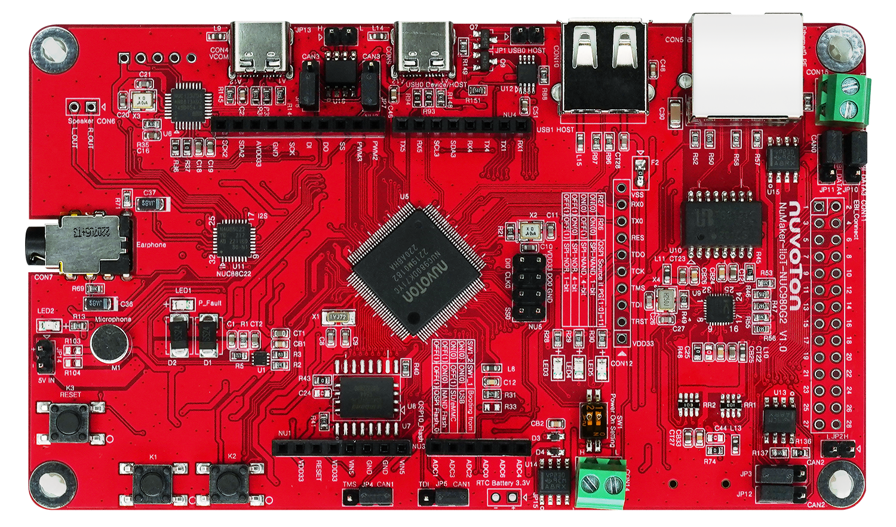
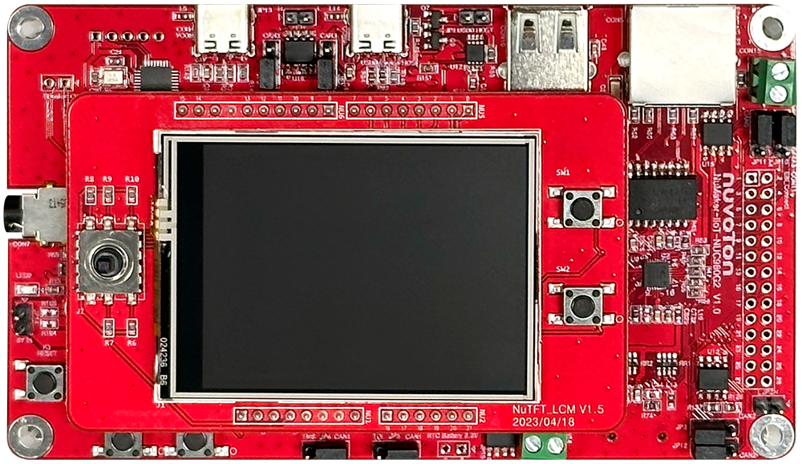

# **NK-980IoTG2 / NK-980IoTG2D**

## 1. **Introduction**

The NuMaker-IIoT-NUC980G2(D) is an evaluation board based on Arm ARM926EJ-S microprocessor
NUC980DK71YC which has rich peripherals to help users to design-in their products or application
systems easily. In addition, the NuMaker-IIoT-NUC980G2 uses NUC980DK71YC microprocessor which
runs up to 300 MHz with built-in 128 MB DDR2 memory, 16 KB I-cache, 16 KB D-cache and MMU, 16
KB embedded SRAM and 16.5 KB IBR (Internal Boot ROM) for system booting from USB, SPI NAND
Flash and SD/EMMC. All functions of the NUC980DK71YC are placed on the board, including peripheral
interfaces such as memory (SPI NAND Flash, eMMC, SD), UART, Audio controller (NAU88C22YG),
10/100 Mbps Ethernet MAC controller, high speed USB (device, HOST), JTAG, CAN and EBI.
Furthermore, the board provides Arduino Uno compatible interface for expansion. You can use it to
develop and verify applications to emulate the real behavior.

|NK-980IOTG2|NK-980IOTG2D|
|--|--|
|||

**NK-980IOTG2D is with ILI9341 SPI TFT panel with RTP touching function**

### 1.1 **MCU specification**

|  | Features |
| -- | -- |
| Part NO. | NUC980DK71YC |
| CPU ARCH. | 32-bit ARM926EJ-STM |
| Operation frequency | 300 MHz |
| Embedded SDRAM size | Built-in 128MB |
| Crypto engine |  AES, RSA, ECC, HMAC and SHA crypto accelerator |
| RMII interface |  10/100 Mbps x2 |
| USB 2.0 |  High Speed Host x1, High Speed Host/Device x1 |
| Audio |  Mono microphone / Stereo headphone |
| Extern storage |  1 Gbit SPI-NAND Flash |
| SD card slot |  SD |
| EBI interface |  External memory expansion interface |

### 1.2 **Interface**

| Interface |
| -- |
| Arduino UNO |
| A RJ45 Ethernet |
| An USB 2.0 HS port |
| An USB 2.0 HS OTG port |
| A microSD slot |
| A 3.5mm Audio connector |
| An EBI connector |
| An ICE connector |
| Four-CAN interfaces |

### 1.3 **On-board devices**

| Device | Description | Driver supporting status |
| -- | -- | -- |
|Ethernet PHY | IP101GR | Supported |
|Button |  | Supported |
|LEDs |  | Supported |
|Audio Codec | NAU8822, Supports MIC and earphone | Supported |
|USB Device | VCOM + MStorage | Supported |
|2xUSB Host | MStorage | Supported |
|SPI NAND flash | W25N01GVZE1G | Supported |
|CAN PHY | SN65HVD230 | Supported |
|LCD | For HMI | Supported. |
|VCOM | For console | Ready.(Need to install VCOM driver) |

## 2. **Supported compiler**

Support GCC and MDK IDE/compilers. More information of these compiler version as following:
| IDE/Compiler  | Tested version            |
| ---------- | ---------------------------- |
| MDK        | uVision 5.29                 |
| GCC | Arm Embedded Toolchain 10.3-2021.10 ([Env 1.3.5 embedded version](https://github.com/RT-Thread/env-windows/archive/refs/tags/v1.3.5.zip))|

Notice: Please install ICE driver for development and [NuMicro_ARM9_Device_Database_Keil](https://www.nuvoton.com/resource-download.jsp?tp_GUID=SW1820201207155701).

## 3. **Build**

### 3.1 **Download SDK**
To execute below command in ENV window to download all rt-thread BSP SDK.
```bash
$ git clone https://github.com/RT-Thread/rt-thread
```

### 3.2 **Download Related packages**
To execute below command in ENV window to download related packages.

```bash
$ cd rt-thread
$ cd bsp/nuvoton/nk-980iotg2d
$ menuconfig --generate
$ pkgs --update
```

### 3.3 **GCC building**

Do gcc building. After building, executable rtthread.bin is outputted in the path.

```bash
$ cd rt-thread
$ cd bsp/nuvoton/nk-980iotg2d
$ scons -j 8

<Path-to-rt-thread>\bsp\nuvoton\nk-980iotg2d\rtthread.bin
```

### 3.4 **Produce MDK4 Project**

Produce MDK4 project file. After producing, project file is outputted in the path.

```bash
$ cd rt-thread
$ cd bsp/nuvoton/nk-980iotg2d
$ scons --target=mdk4 –s

<Path-to-rt-thread>\bsp\nuvoton\nk-980iotg2d\project.uvproj
```

Notice: Please also install [MDK4 for Nuvoton ARM9 device pack](https://www.nuvoton.com/resource-download.jsp?tp_GUID=SW1820201207155701).

## 4. **Deploy**

### 4.1 **SDRAM Downloading using NuWriter**

You can use NuWriter to download rtthread.bin into SDRAM, then run it.
<br>
Choose type: DDR/SRAM<br>
<< Press Re-Connect >><br>
Choose file: Specify your rtthread.bin file.<br>
Execute Address: 0x0<br>
Option: Download and run<br>
<< Press Download >><br>
Enjoy!! <br>
<br>

### 4.3 **SPI NAND flash using NuWriter**

You can use NuWriter to program rtthread.bin into SPI NAND flash.
<br>
Choose type: SPINAND<br>
<< Press Re-Connect >><br>

<< Press Erase >><br>
<< Select Erase All >><br>
<< Press OK >><br>

Choose file: Specify your uboot-spl.bin file.<br>
Image Type: Loader<br>
Execute Address: 0x200<br>
<< Press Program >><br>

Choose file: Specify your uboot.bin file.<br>
Image Type: Data<br>
Image start address: 0x100000<br>
<< Press Program >><br>

Choose file: Specify your rtthread.bin file.<br>
Image Type: Data<br>
Image start address: 0x200000<br>
<< Press Program >><br>

Choose file: Specify your env.txt file.<br>
Image Type: Environment<br>
Image start address: 0x80000<br>
<< Press Program >><br>

<< Press OK & Wait it down >><br>
<< Set Power-on setting to SPI NAND booting >><br>
<< Press Reset button on board >><br>
Enjoy!! <br>
<br>

## 5. **Test**

You can use Tera Term terminate emulator (or other software) to type commands of RTT. All parameters of serial communication are shown in below image. Here, you can find out the corresponding port number of Nuvoton Virtual Com Port in window device manager.

## 6. **Purchase**

* [Nuvoton Direct][1]

## 7. **Resources**

* [Download Board Schematics][2]
* [Download TRM][3]
* [Download NuWriter][4]

  [1]: https://direct.nuvoton.com/tw/numaker-iiot-nuc980g2d
  [2]: https://www.nuvoton.com/resource-download.jsp?tp_GUID=UG1020190308162722
  [3]: https://www.nuvoton.com/resource-download.jsp?tp_GUID=DA05-NUC980-1
  [4]: https://github.com/OpenNuvoton/NUC980_NuWriter
